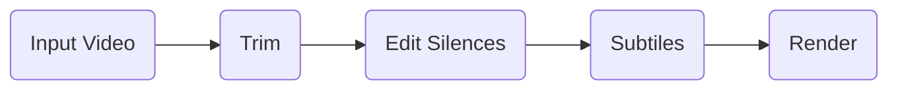

import {cloudUpgradePath, cloudSettingsPath, cloudDashboardPath} from '/snippets/cloud/path-variables.mdx';

import CloudLink from '/snippets/cloud/link.mdx';


## Overview
**video.dev** enables the creation of high-quality video content at scale by simplifying the development of powerful AI-driven video pipelines in the cloud directly from your code.

### Key Features

- **Comprehensive Toolbox**: A curated collection of solutions, AI models, and utilities specifically designed for high-quality video production.
{/* - **Pre-built, Production-ready Apps and Models**: Use ready-made apps and models with a single click or API call. */}
- **Streamlined App Development**: Seamlessly combine various tools, models, and utilities to craft robust video pipelines capable of rapid video processing with minimal code.
{/*- **Complex App Building**: Construct sophisticated applications utilizing multiple models with just a few lines of code.*/}
{/*- **Instant No-code Interfaces**: Automatically generate user interfaces for every app on video.dev with zero extra configuration.*/}
- **Scalable Infrastructure**: Benefit from reliable, horizontally scaling infrastructure that adapts to traffic demands.
{/* - **Distributed Primitives**: Leverage powerful distributed primitives like queues and async jobs to parallelize data processing. */}

## Before you begin
If you haven’t already, sign up for a free <CloudLink title="video.dev" />  account and get your API key.
\
\
On sign up you will get 10$ credit to get started. You can <CloudLink title="upgrade" path={cloudUpgradePath}/>   whenever you’re ready.

### 1. Install the python client


```bash
pip install video-dev
```


### 2. Get your API key

1. Navigate to video.dev  <CloudLink title="settings" path={cloudSettingsPath}/>
2. Go to API Keys
3. Create a new API Key
4. Copy your API key

### 3. Login with your API Key
```bash
video-dev login
```

## Deploying a simple editing pipeline



Trims the source video, followed by silencing edits, subtitle addition, and finally, rendering the completed video.


<Steps>
  <Step title="Make a new directory">
    ```bash
    mkdir trim_edit_and_subtitle
    ```
    ```bash
    cd trim_edit_and_subtitle
    ```
  </Step>
  <Step title="Create main.py and copy this code">
   ```python main.py

import video_dev
from video_dev import Function, VideoFile, function

@function(name="trim_edit_and_subtitle")
def trim_edit_and_subtitle(file_url: str, start: int, end: int, silence_threshold: int) -> str:
    """
    :param fileUrl: source video file URL to edit
    """

    trim = Function("video_dev/trim")
    edit_silence = Function("video_dev/edit_silence")
    burn_subtitle = Function("video_dev/burn_subtitle")

    video_file = VideoFile(fileUrl)

    video_trimmed_file = trim(video_file, start, end)

    silence_edited_file = edit_silence(video_trimmed_file, silence_threshold)

    subtitled_file = burn_subtitle(silence_edited_file)

    return subtitled_file.get().url

```
  </Step>
  <Step title="Deploy the pipeline to video.dev">
  <Info>
  Make sure you are in the correct directory `trim_edit_and_subtitle`


  </Info>
    ```bash
    video-dev deploy
    ```

   Pipeline should only take a few seconds to deploy, after which you’ll see a link to your newly deployed pipeline on the video.dev <CloudLink title="dashboard" path={cloudDashboardPath}/>.


  </Step>
  <Step title="Run the deployed pipeline">
   Navigate to your pipeline on the video.dev <CloudLink title="dashboard" path={cloudDashboardPath}/> and upload a sample file to test out the pipeline.

or call your pipeline via API call or the Python client.
<Info>

Make sure to replace `<org-name>` with your organisation name and  `<api-key>` with your API key.

</Info>
<CodeGroup>
```python Python
from video_dev import Function, VideoFile

trim_edit_and_subtitle = Function("<org-name>/trim_edit_and_subtitle")

# This will create a pipeline instance and run in the cloud!
output = trim_edit_and_subtitle(VideoFile(path="./input.mp4"))
print(output)

```


```bash API
curl -X POST \
  --url https://api.video.dev/v1/run \
  -H 'X-API-Key: <api-key>' \
  -H 'Content-Type: application/json' \
  --data '{
    "function": "<org-name>/trim_edit_and_subtitle"
    "inputs": {
      "file": {"url": "https://storage.googleapis.com/sample_bucket/input.mp4"},
    }
  }'
```
</CodeGroup>
  </Step>
</Steps>

#### Explanation

We have built a pipeline to trim, edit and subtitle the video in a few lines of code.

At its core, we used 2 functions to build this app:

- `video-dev/trim`: Trims video with given start and end time.
- `video-dev/edit_silence`: Removes long silence from the video with given threshold.
- `video-dev/burn_subtitle`: adds subtitle to the video.

video.dev makes it easy to use any public functions in the video.dev cloud, synchronously or asynchronously.

We wrote all of our logic for the pipeline in a single function and defined our own custom function with the `@function` decorator.

Deploying the pipeline with `video-dev deploy` lets us run this pipeline via API and lets us visualize our inputs & outputs via the video.dev <CloudLink title="dashboard" path={cloudDashboardPath}/>!

## Next

<CardGroup cols={2}>
<Card
    title="Quickstart"
    icon="bolt"
    href="https://mintlify.com/docs/quickstart"
  >
    Build your first app.
  </Card>
  <Card
    title="Guides"
    icon="books"
    href="https://mintlify.com/docs/quickstart"
  >
    Get your docs set up locally for easy development
  </Card>
  <Card
    title="Reference APIs"
    icon="code"
    href="https://mintlify.com/docs/api-playground/openapi"
  >
    Automatically generate endpoints from an OpenAPI spec
  </Card>
  <Card
    title="Tools"
    icon="screwdriver-wrench"
    href="https://mintlify.com/docs/development"
  >
    Preview your changes before you push to make sure they're perfect
  </Card>


  <Card
    title="Integrations"
    icon="plug"
    href="https://mintlify.com/docs/components/accordion"
  >
    Build interactive features and designs to guide your users
  </Card>
  <Card
    title="Releases"
    icon="rocket"
    href="https://mintlify.com/customers"
  >
    Check out our showcase of our favorite documentation
  </Card>
</CardGroup>


---
## Support

If you require help or have queries, don't hesitate to hop into our Discord community. We're excited to witness what you create!


